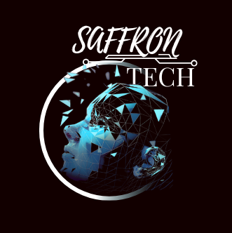

<!-- SAFFRON INNOVATORS HUB README -->

  

<h1 align="center">⚙️ Saffron Innovators Hub</h1>
<h3 align="center">Where creativity meets engineering 🚀</h3>

---

### 🌟 About Us  
Welcome to **Saffron Innovators Hub** — a community built by passionate minds exploring the world of **engineering, robotics, electronics, IoT, embedded systems, and AI/ML**.  

We’re **engineering students from distinct branches**, united by our drive to **innovate, build, and inspire**.  
From circuit boards to intelligent systems, we bring ideas to life through **collaboration, experimentation, and curiosity**.  

We believe every idea — no matter how small — can ignite innovation when fueled by passion and teamwork.  
That’s why we don’t just build projects — we build possibilities.  

---

### 💡 What We Do  
- 🤖 Robotics & Embedded Systems  
- 📡 IoT & Automation Projects  
- 🧠 AI & Machine Learning Experiments  
- ⚙️ Electronics Design & Prototyping  
- 💻 Open-Source Innovation  
- 🧩 Creative Engineering & Concept Development  

Our work blends **hardware and software**, bridging imagination with real-world applications — one project at a time.

---

### 🔗 Connect With Us  

  
  
  
  
  
  
  

---

### 🧠 Managed By  
👑 [@saffrontech_](https://www.instagram.com/saffrontech_/)&nbsp;*(Admin)*  
👤 [@pandey_divyansh__](https://www.instagram.com/pandey_divyansh__/)  
👤 [@prince_g.48](https://www.instagram.com/prince_g.48/)  
👤 [@nandani_dubey__](https://www.instagram.com/nandani_dubey__/)

---

### 💬 Motto  
> **Innovate. Build. Inspire.**  
> — Team Saffron 🚩  

---

### ⚡ Our Vision  
We aim to **bridge creativity and technology** — empowering the next generation of innovators to explore, experiment, and engineer solutions that matter.  
Every challenge is an opportunity, every project a new journey — and we’re just getting started.  

Let’s reimagine what’s possible — **one circuit, one code, and one idea at a time.**

---

  <b>© 2025 Saffron Innovators Hub</b> 
  <i>Crafted with ⚙️ passion, 🤝 teamwork, and 🚀 curiosity.</i>

